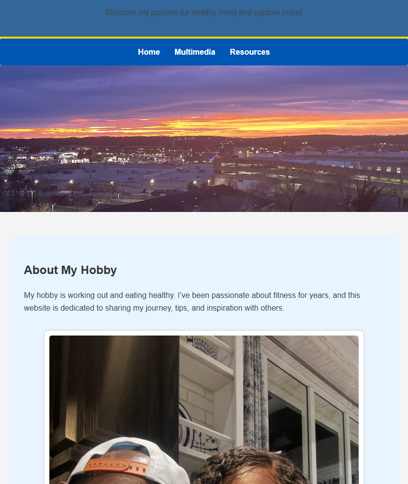

# Marcus’s Hobby Website

**Description**  
A responsive, multi-page personal site built with HTML, CSS, and JavaScript.

## Features  
- Semantic HTML layout with `<header>`, `<main>`, `<section>`, `<footer>`  
- Flexbox-based galleries for videos and images  
- Gold accent stripes and consistent header/footer design  
- JavaScript mini-widget: theme toggle (dark/light mode)

## Screenshots  
*(Place your screenshots in a `screenshots/` folder and reference them here.)*  
  
  
  

## Setup  
```bash
git clone https://github.com/MarcusPiperAllen/Marcus_Hobby.git
cd Marcus_Hobby
open index.html in your browser
